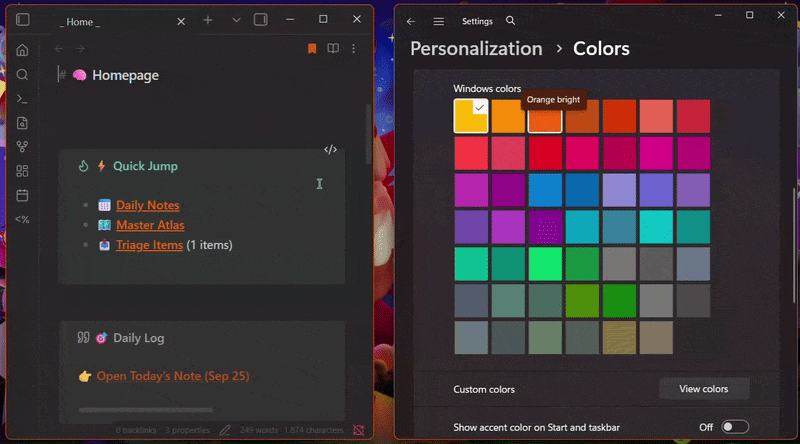
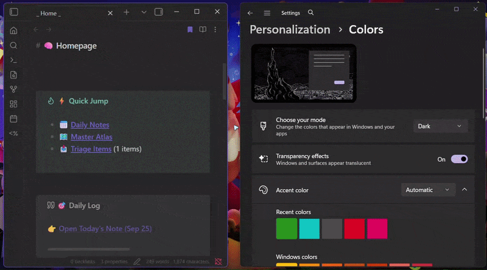

# OS Accent Color Sync

A desktop-only Obsidian plugin that keeps the app's accent color synchronized with your operating system accent color.



This plugin reads the active accent color from Windows or macOS system settings and applies it to Obsidian, so the app theme matches the rest of your desktop environment.

 

The plugin saves your existing Obsidian accent color separately and restores it when automatic sync is disabled or the plugin is unloaded.

## Features

- Syncs Obsidian’s accent color with the OS accent color automatically
- Supports Windows and macOS accent detection
- Includes a manual sync command for immediate updates
- Allows automatic polling with a configurable interval
- Optionally uses Windows' Explorer fallback accent when the detected accent is nearly grey
- Watches for focus and theme changes to refresh when needed
- Falls back to Chromium system accent color detection when OS-specific values are unavailable

## Supported platforms

- Windows 10/11
- macOS
- Desktop-only plugin behavior in Obsidian

## How it works

- On Windows, the plugin reads the DWM AccentColor value from the Windows registry.
- When enabled, a nearly grey Windows accent is replaced with Explorer's StartColorMenu registry value (a fallback used by Windows DWM, also used in i.e. Microsoft PowerToys).
- On macOS, it attempts to read AppleHighlightColor or AppleAccentColor settings.
- If those sources are unavailable, it falls back to the browser’s CSS AccentColor value.
- The detected color is then applied to Obsidian's accent styling and refreshed when changes are detected.
- Your existing Obsidian accent color is saved before the first override, then restored when automatic sync is disabled or the plugin is unloaded.

## Installation

1. Download or clone this repository.
2. Copy the plugin folder into your Obsidian vault under `.obsidian/plugins/`.
3. Reload Obsidian and enable the plugin from Settings → Community plugins.
4. Optionally configure automatic sync and polling in the plugin settings.

## Development

This project is built with TypeScript and bundled using esbuild.

### Install dependencies

```bash
npm install
```

### Build the plugin

```bash
npm run build
```

This outputs the `build/` folder with the `manifest.json` and the plugin file `main.js` for Obsidian.

## Usage

After enabling the plugin:

- Automatic sync runs according to the configured polling interval.
- The plugin also re-checks the accent color when Obsidian regains focus.
- You can trigger a manual sync from the command palette via:
  - `Sync accent color with OS now`

## TODOs

- [x] ~~Store and separate the previously set Obsidian accent color from the system-derived one.~~  
  The plugin now saves the accent color before first use AND when autoSync is turned off/ the plugin is unloaded, restores it.
- [x] ~~Implement color contrast checking. If the chosen accentColor is bad for contrast, use e.g. the complimentary color or a default.~~  
  Solved with WCAG relative contrast testing and some iterative calculations (hopefully fast enough, without hogging the system).
- [ ] ...

## Credit and note

This plugin was made with the help of Gemini AI, but the final implementation was reviewed by me.

This plugin has not been reviewed by Obsidian staff yet, and should be used with that in mind.

## License

MIT
